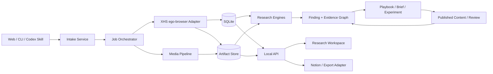

# Signal Room — System Architecture

## 1. Architectural decision

Signal Room is a local-first modular monolith with explicit ports for browsers, platforms, media processing, models, storage, and exports. A long-lived `ResearchProject` is the aggregate presented to users. `AnalysisRun` is a retryable execution record, not the product root.



## 2. Module boundaries

```text
apps/
  web/                    research workspace
  cli/                    deterministic operator commands
packages/
  domain/                 Zod contracts and domain rules
  storage/                SQLite repositories and migrations
  artifacts/              content-addressed file store
  browser-ego/            task-space lifecycle and browser primitives
  platform-xhs/           Xiaohongshu resolvers and collectors
  media/                  ffprobe, transcription, scenes, frames, OCR
  research-single/        single-post analysis
  research-cohort/        comparable-set analysis
  research-creator/       creator operating-system analysis
  findings/               evidence graph and review workflow
  actions/                playbook, brief, experiment, review
  exports/                HTML, JSON, Notion-ready summaries
skills/
  content-intelligence/   thin Codex orchestration skill
specs/
fixtures/
```

Platform code may produce facts and evidence; it may not produce unlabeled strategic conclusions. Research engines consume normalized domain objects, not page DOM.

## 3. Runtime components

### Local API

- TypeScript service using versioned Zod contracts.
- REST in MVP; background jobs expose status and checkpoint state.
- Server-Sent Events for progress updates.
- Endpoints are project-oriented; Run diagnostics are nested.

### SQLite

- Normalized entities and append-only snapshots.
- Foreign keys enabled.
- WAL mode for local web/worker concurrency.
- Schema migrations are versioned and idempotent.

### Artifact store

- Filesystem rooted outside source control.
- Content-addressed where possible.
- Stores raw snapshots, media, transcripts, frames, contact sheets, exports, and calculation inputs.
- Database stores references, checksums, provenance, and timestamps.

### Worker/orchestrator

- Durable job table rather than an in-memory queue.
- Stages: resolve, collect profile/post, collect metrics/comments, acquire media, transcribe, segment, analyze, index, export.
- Each stage is idempotent and checkpointed.
- Partial success remains inspectable.

## 4. Input resolution

```text
InputEnvelope
  rawText
  urls[]
  requestedMode?
  researchQuestion?
  objective?
  browserTaskSpace?
```

Resolver outputs one of:

- `post`
- `creator_profile`
- `multi_post`
- `topic_query`
- `unknown`

Unknown input remains in the inbox with a reason; the system never fabricates a sample.

## 5. Xiaohongshu adapter

The first-party MVP adapter uses ego-browser as its authenticated execution port.

```ts
interface XhsCollector {
  inspectSession(): Promise<BrowserSessionState>;
  resolve(input: InputEnvelope): Promise<ResolvedXhsInput>;
  collectCreator(ref: CreatorRef, cursor?: string): AsyncIterable<CreatorCollectionPage>;
  collectPost(ref: PostRef): Promise<CollectedPost>;
  collectComments(ref: PostRef, policy: CommentPolicy): AsyncIterable<CommentPage>;
  acquireMedia(ref: PostRef): Promise<MediaAcquisitionResult>;
}
```

The adapter returns provenance-rich facts. DOM selectors, browser events, and request shapes remain internal adapter details.

## 6. Media evidence pipeline

```text
MediaAsset
  → probe metadata
  → audio extraction
  → transcript + language/term uncertainty
  → scene boundary detection
  → sparse frames
  → dense frames near high-change windows
  → cue midpoint frames
  → cue ↔ overlapping shot mapping
  → contact sheets and evidence index
```

Every transcript cue keeps raw text, normalized suggestion, confidence, reviewer status, time range, midpoint frame, and all overlapping shot IDs. A representative frame is never described as representing an entire interval without qualification.

## 7. Research engines

### Single

Consumes one subject plus optional author/topic baselines. Produces packaging, script, visual, proof, audience, traffic-quality, edit-decision, and replication findings.

### Cohort

Consumes an explicit sample and comparability rules. Produces distributions, effect direction, coverage, representative evidence, exceptions, and confounds. It refuses stable-law language for small or incomparable samples.

### Creator

Consumes creator snapshots and sampled content across time. Produces positioning, pillars, formats, visual/script grammar, evolution, outliers, account dependencies, reusable capabilities, and launch hypotheses.

## 8. API surface

Representative MVP endpoints:

```text
POST   /api/intake/resolve
POST   /api/projects
GET    /api/projects/:id
PATCH  /api/projects/:id
POST   /api/projects/:id/samples
POST   /api/projects/:id/runs
GET    /api/runs/:id
GET    /api/content/:id
GET    /api/content/:id/evidence
GET    /api/creators/:id
POST   /api/findings/:id/reviews
POST   /api/findings/:id/playbooks
POST   /api/projects/:id/briefs
POST   /api/briefs/:id/experiments
POST   /api/published-content
POST   /api/published-content/:id/metric-snapshots
POST   /api/published-content/:id/reviews
```

## 9. Codex Skill boundary

`content-intelligence` is a thin router over stable CLI/API operations:

```text
signal-room ingest <input> --browser-space <local-task-space>
signal-room project create --type single_post|series_topic|creator
signal-room analyze --project <id>
signal-room breakdown --content <id>
signal-room brief --project <id>
signal-room review --published <id>
signal-room open --project <id>
```

The Skill owns workflow discipline and validation. It does not contain platform selectors, creator-specific prompts, or business data.

## 10. Security and compliance

- Never commit browser profiles, cookies, signed media URLs, or collected private data.
- Store only data visible to the authenticated user and required by the research project.
- Stop for captcha, access denial, risk-control interstitials, or user takeover.
- Redact secrets from logs and exports.
- Provide artifact and project deletion with exact-target checks.
- Public fixtures contain no copyrighted video or redistributed creator corpus.

## 11. Reliability

- Every stage has an input fingerprint and idempotency key.
- Re-running collection appends snapshots rather than overwriting history.
- Browser task-space ownership is explicit.
- Interrupted creator pagination resumes from a persisted cursor.
- Failed media processing does not delete collected source facts.
- Analysis output records schema version, model version, inputs, and evidence coverage.

## 12. Testing

- Unit: resolvers, schemas, ratios, null handling, evidence relations.
- Contract: ego-browser port and synthetic Xiaohongshu fixtures.
- Integration: SQLite migrations, artifact indexing, project/run lifecycle.
- Browser: intake, progress, evidence drill-down, review, brief generation.
- Golden: stable JSON outputs for synthetic single/cohort/creator projects.
- Real validation: three authenticated Xiaohongshu vertical slices, never committed as fixtures.
