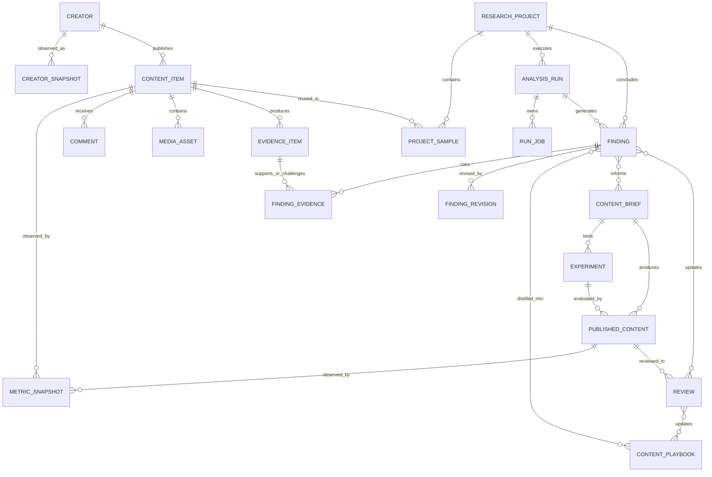

# Signal Room — Data Model

## 1. Ownership model



## 2. Core enums

```text
Platform          xiaohongshu
ProjectType       single_post | series_topic | creator
Objective         awareness | growth | authority | conversion
ProjectStatus     inbox | scoping | collecting | analyzing | ready | needs_data | archived
RunStatus         queued | running | interrupted | complete | partial | blocked | failed
RunJobStatus      pending | running | interrupted | complete | blocked | failed
FindingType       fact | observation | hypothesis | unknown
ReviewStatus      machine_draft | human_confirmed | human_revised | rejected
EvidenceRelation  supports | contradicts | alternative | calculation_input
SourceTier        public | comparative | owner | manual
SampleRole        subject | author_baseline | topic_peer | manual_reference | candidate
Cohort             winner | middle | underperformer | unassigned
```

## 3. Entity contracts

### Creator

- `id`: UUID
- `platform`, `externalId`: unique pair
- `handle`, `name`, `profileUrl`
- `firstSeenAt`, `lastCollectedAt`

### CreatorSnapshot

- `creatorId`, `observedAt`
- `followers`, `totalLikesAndBookmarks`, `bio`
- `verificationStatus`, `rawArtifactRef`

Changing profile facts append snapshots; they do not overwrite history.

### ContentItem

- `platform`, `externalId`: unique pair
- `creatorId?`, `contentType`, `sourceUrl`
- `title`, `body`, `tagsJson`, `publishedAt?`
- `firstSeenAt`, `latestSourceArtifactRef?`

### MetricSnapshot

- polymorphic `subjectType + subjectId`
- `sourceTier`, `observedAt`, `contentAgeHours?`
- nullable `views`, `likes`, `comments`, `shares`, `bookmarks`, `quotes`
- nullable owner fields: `followersGained`, `profileVisits`, `leads`, `conversions`, `cost`
- `rawArtifactRef?`

Unknown metrics are `null`; zero means an observed zero.

### Comment

- stable platform ID when available
- `contentItemId`, author reference, raw text, likes, observedAt
- parent/reply relationship
- raw artifact reference

### MediaAsset

- `contentItemId`, kind, source URL fingerprint, local artifact reference
- duration, dimensions, MIME, checksum
- acquisition status and provenance

### EvidenceItem

- optional `contentItemId` and `creatorId`
- type: source text, metric, comment, transcript, frame, shot, profile, calculation, manual note
- `sourceTier`, `locator`, `excerpt?`, `artifactRef?`, `checksum?`, `observedAt`
- evidence-specific JSON payload with a versioned schema

### ResearchProject

- type, title, research question, objective
- platform scope, observation window, comparability rules
- user-facing status and timestamps

### ProjectSample

- project/content relation
- role, cohort, inclusion reason, exclusion reason, included flag
- unique `projectId + contentItemId`

### AnalysisRun

- project ID, run type, status
- schema/model versions, input fingerprint
- start/finish timestamps, checkpoint, report artifact

### RunJob

- ordered stage and stage input fingerprint;
- status, attempt, and a stage-safe JSON checkpoint;
- error category and recovery action;
- lease owner, lease acquisition/expiry, heartbeat, start/finish/update times.

`prepare`, `research`, and `finalize` are the current single-post stages. A
service restart changes an active Run to `interrupted`; it never silently claims
pending work. Completed stages remain complete when the user explicitly resumes.
Findings are unique by source Run and dimension so a retried research stage
cannot duplicate them.

### Finding

- project and source run
- type, dimension, atomic statement, confidence, scope
- review status and supersession link

### FindingEvidence

- finding/evidence relation
- relation type, optional weight, explanatory note

### FindingRevision

- previous and next statement/status
- reason, actor, timestamp

### ContentPlaybook

- type: success structure, failure pattern, script template, visual grammar, platform tactic
- statement, applicability, prerequisites, counterexamples
- lifecycle: draft, validated, deprecated

### ContentBrief

- target audience, job, promise, structure, proof requirements, CTA
- invariants, variables, risks, source findings
- production and review status

### Experiment

- hypothesis, variant definitions, primary metric, guardrails
- success criteria, minimum runs, measurement status

### PublishedContent and Review

- published platform identity and link to brief/experiment
- append-only metrics
- review decision and links to findings/playbooks updated

## 4. Transcript and shot evidence

Transcript cues include:

- raw text and normalization suggestion;
- start/end, confidence, unresolved terms;
- reviewer status;
- midpoint frame ID;
- all overlapping shot IDs.

Shot evidence includes:

- start/end and boundary reason;
- representative frame;
- on-screen text;
- observed function and machine confidence;
- edit decision: `keep | compress | remove | undecided`;
- rationale and target duration.

## 5. Snapshot rules

- Source and metrics are append-only.
- Derived ratios are reproducible calculations with explicit numerator, denominator, formula, and observation window.
- Content deletion does not silently delete findings; affected evidence becomes unavailable and findings are marked stale.
- Human revisions never overwrite the machine draft without history.
