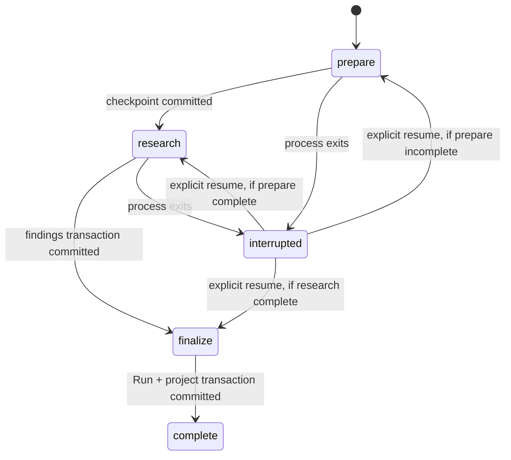

# Durable Run Recovery — Design

## Architecture

The existing `SignalRoomService` remains the application boundary, but a Run is
no longer equivalent to one callback. Each Run owns an ordered, persisted stage
ledger:

The scheduler only requests that the service claim the next persisted job. The
SQLite claim is authoritative, so duplicate callbacks and duplicate HTTP resume
requests cannot execute the same pending stage twice.

## Domain model

`AnalysisRun.status` gains `interrupted`. `RunJob` contains:

| Field | Purpose |
| --- | --- |
| `stage`, `sequence` | Ordered `prepare`, `research`, `finalize` ledger |
| `status` | `pending`, `running`, `complete`, `blocked`, `failed`, `interrupted` |
| `inputFingerprint` | Versioned Run/stage input identity |
| `attempt` | Number of successful claims |
| `checkpoint` | Stage-safe, JSON-serializable resume state |
| `errorCategory` | Public-safe stop/failure classification |
| `leaseOwner`, lease times | Process claim metadata |
| `heartbeatAt` | Last persisted liveness observation |
| `recoveryAction` | Specific operator/user next action |

Raw stack traces or browser state are not part of the public Run view.

## SQLite changes

Migration v2 extends the existing `jobs` table with sequence, attempt, error
category, lease/heartbeat, lifecycle timestamps, and recovery action. It adds a
unique index on `(source_run_id, dimension)` so a retried research transaction
cannot duplicate findings.

The storage package owns all state transitions as synchronous SQLite
transactions:

- create-or-get Run plus all stage jobs;
- claim next pending job and mark the Run running;
- commit prepare checkpoint;
- atomically insert idempotent findings and commit research checkpoint;
- atomically complete finalize, Run, and Project;
- atomically record blocked/failed/partial outcomes;
- reconcile active Runs to interrupted on service startup;
- prepare a recoverable Run for explicit resume.

## Stage behavior

### Prepare

Resolve the persisted subject, source-text evidence, metric evidence, and metric
snapshot. Persist their stable IDs as the checkpoint. This stage does not invoke
ego-browser.

### Research

Rehydrate the bounded single-post research input from persisted evidence. Run
the existing deterministic research contract. Insert findings and evidence
relations in the same transaction that completes the stage. A uniqueness
constraint and insert-or-return-existing behavior make retries idempotent.

### Finalize

Verify prior stages are complete, then atomically complete the job and Run and
mark the Project ready.

## Startup and resume semantics

Constructing a service is the local single-writer startup boundary. It
reconciles pre-existing active Runs to `interrupted`, clears abandoned leases,
and schedules nothing. This is deliberately conservative: persisted work is
never silently replayed.

`POST /api/runs/:id/resume` is the only recovery trigger. It preserves completed
stages, resets the first recoverable stage to pending, and schedules one claim.
Two resume calls can at most create duplicate callbacks; SQLite permits only one
claim. A user-takeover hard stop therefore cannot reclaim ego-browser without a
new user action.

## Web interaction

The existing project page keeps its industrial/editorial layout. The Run band
shows the ordered stage ledger, attempt counts, recovery action, and one explicit
resume button for `interrupted`, `partial`, `blocked`, or `failed`. The button
label states that the user is confirming the recovery condition has been
handled. Narrow screens stack the ledger and action vertically.

## Test strategy

- Domain tests validate new schemas and status contracts.
- Storage tests validate migration fields, reconciliation, claims, and
  idempotent domain persistence.
- API tests validate start/resume state transitions and hard stops.
- Root integration tests use the actual Web API helper against Fastify injection
  backed by an on-disk SQLite database, close/reopen the database between
  stages, and assert one Run, one job ledger, and one set of findings.
- Existing CORS, internal-error redaction, evidence, and visual-contract tests
  remain mandatory.

## Rollback and compatibility

Migration v2 is additive except for the findings uniqueness index. Existing Run
and finding rows remain readable. Rolling application code back after applying
v2 leaves additional nullable/defaulted columns that v1 code ignores. The
`interrupted` status requires current domain code; no destructive down migration
is provided for local user data.

